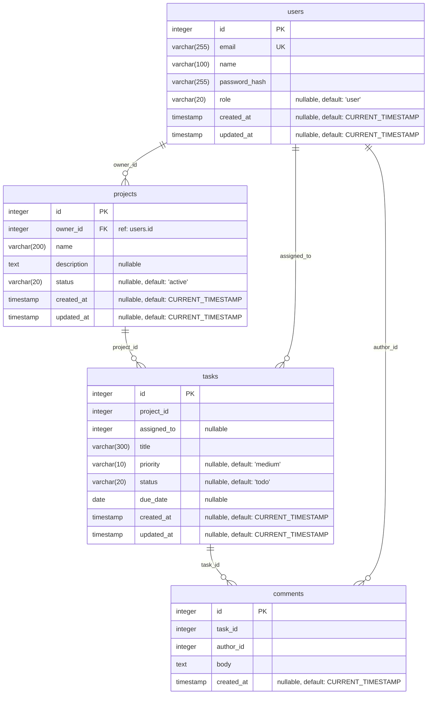

```mermaid
erDiagram
    users {
        integer id PK
        varchar(255) email UK
        varchar(100) name
        varchar(255) password_hash
        varchar(20) role "nullable, default: 'user'"
        timestamp created_at "nullable, default: CURRENT_TIMESTAMP"
        timestamp updated_at "nullable, default: CURRENT_TIMESTAMP"
    }
    projects {
        integer id PK
        integer owner_id FK "ref: users.id"
        varchar(200) name
        text description "nullable"
        varchar(20) status "nullable, default: 'active'"
        timestamp created_at "nullable, default: CURRENT_TIMESTAMP"
        timestamp updated_at "nullable, default: CURRENT_TIMESTAMP"
    }
    tasks {
        integer id PK
        integer project_id
        integer assigned_to "nullable"
        varchar(300) title
        varchar(10) priority "nullable, default: 'medium'"
        varchar(20) status "nullable, default: 'todo'"
        date due_date "nullable"
        timestamp created_at "nullable, default: CURRENT_TIMESTAMP"
        timestamp updated_at "nullable, default: CURRENT_TIMESTAMP"
    }
    comments {
        integer id PK
        integer task_id
        integer author_id
        text body
        timestamp created_at "nullable, default: CURRENT_TIMESTAMP"
    }
    projects ||--o{ tasks : "project_id"
    users ||--o{ tasks : "assigned_to"
    tasks ||--o{ comments : "task_id"
    users ||--o{ comments : "author_id"
    users ||--o{ projects : "owner_id"
```
